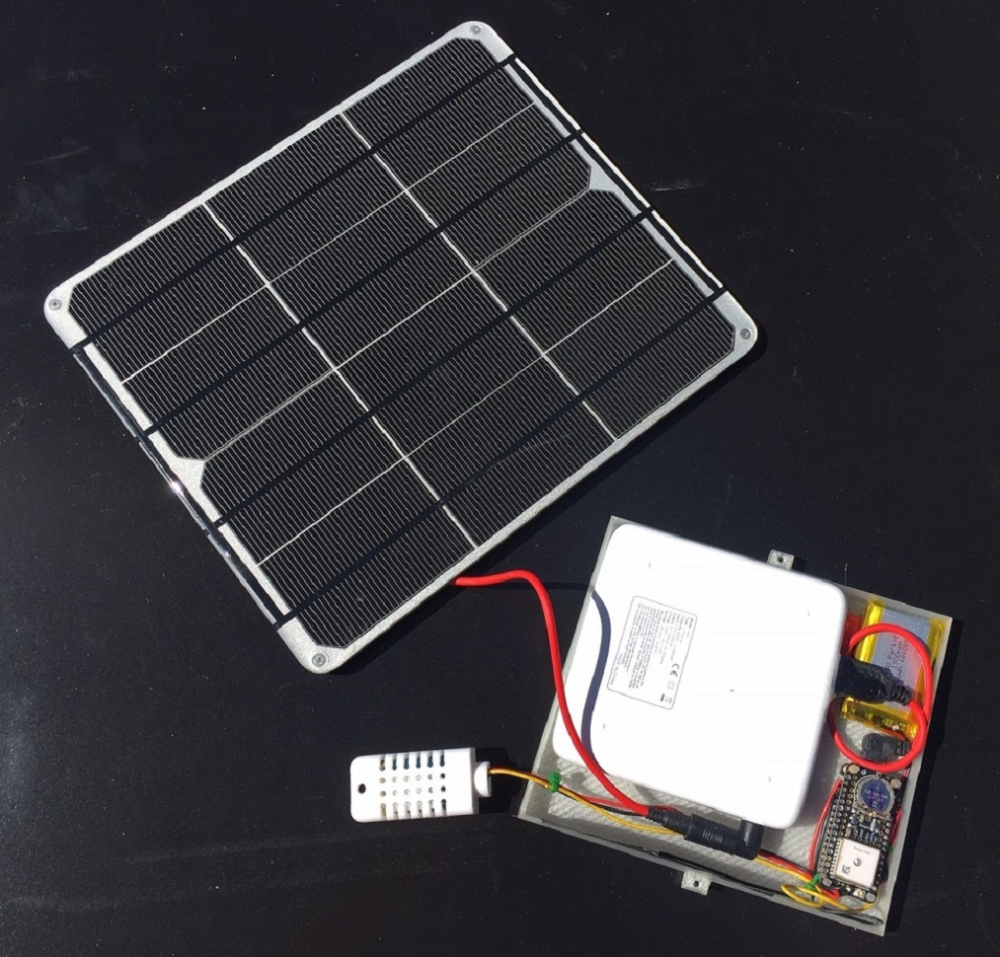
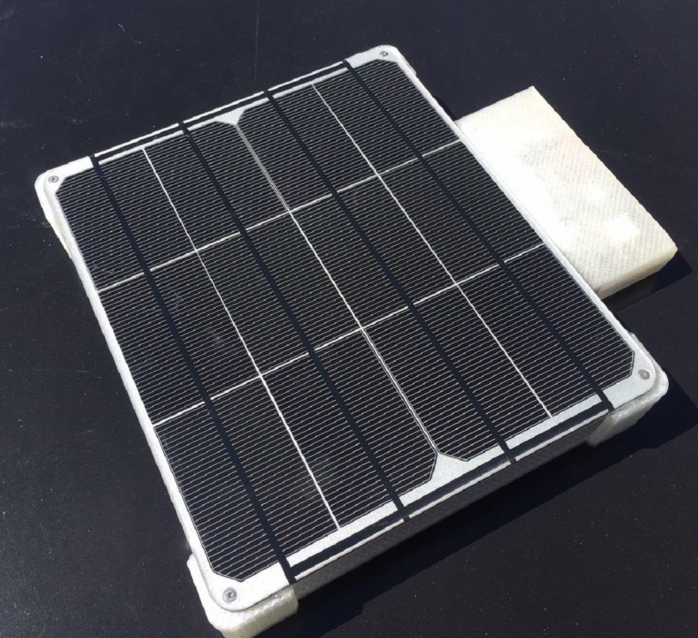
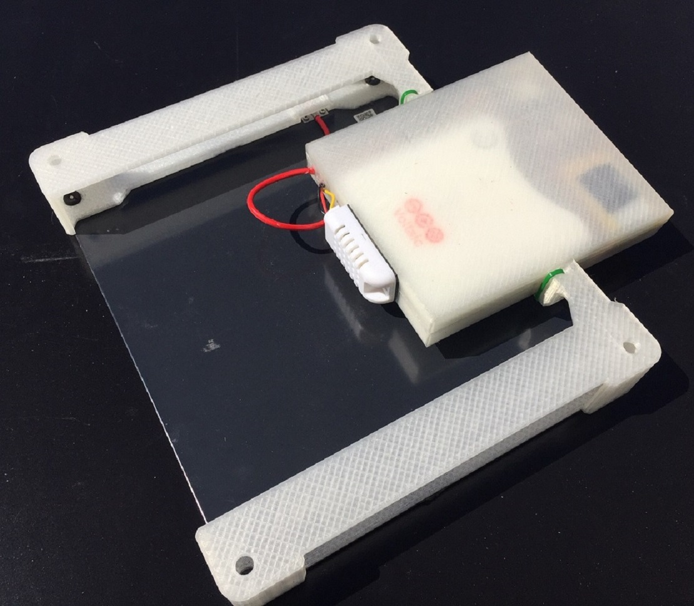

# mhip_tracker

## Introduction

With my interest in IoT, the Internet-of-Things, I decided to create a device to addresses a use case I have, asset tracking.  Specifically I wanted a self-contained, solar powered GPS Tracker that periodically reports position to a cloud data store.  Primarily I'll use this to track by travels (I travel a lot in an RV).

This project will cover all aspects of the tracker device including hardware, software, packaging, and data visualization.

### Parts Used

- [Particle.io Boron](https://docs.particle.io/datasheets/cellular/boron-datasheet/)
  - An Arduino compatible controller with cellular connectivity.
- [Adafruit GPS FeatherWing](https://www.adafruit.com/product/3133)
  - -165 dBm sensitivity, 10 Hz updates, 66 channels with internal patch antenna
- [Adafruit Temperature/Humidity Sensor](https://www.adafruit.com/product/393)
  - wired DHT22 sensor in a plastic housing
- [Voltaic USB Battery Pack](https://www.voltaicsystems.com/v44)
  - Model V44, 12,000mAh / 44 Watt hour
- [Voltaic Solar Panel](https://www.voltaicsystems.com/9-watt-panel)
  - 9 watts, 6 volts, plugs directly into the V44 battery pack.
- Component case and solar panel mount
  - Custom 3D printed
- Double-sided tape, grommets, bolts and nuts

### Services Used

- [Particle.io Cloud](https://www.particle.io/)
- Microsoft Azure
  - [IOT Hub](https://azure.microsoft.com/en-us/services/iot-hub/)
  - [Event Grid](https://azure.microsoft.com/en-us/services/event-grid/)
  - [Table Storage](https://azure.microsoft.com/en-us/services/storage/tables/)

### Discussion

The "brains" of Tracker is the particle.io Boron controller board.  The Boron is Arduino compatible and in the Adafruit Feather [formfactor](https://learn.adafruit.com/adafruit-feather/feather-specification). In addition to the controller it has a cellular modem that communicates with the cellular network.  Depending on the model you choose, it can use either G2/G3 or LTE.  I chose G3 since it gives greater coverage compares to LTE.

The Boron includes a SIM that you activate with the particle.io mobile app running on either an [Android](https://play.google.com/store/apps/details?id=io.particle.android.app&hl=en_US) or the [iPhone](https://itunes.apple.com/us/app/particle-iot/id991459054).  Out of the box, Boron communicates with the particle.io cloud (at the time of this writing the particle.io cloud is free for the first three months then $2.99 per month per device).  With their cloud subscription you get 3MB of data per month. Additional megabytes start at $0.40/MB.  In addition to activating your Boron, the mobile app can be used to monitor and control your devices.

In addition to cellular connectivity, the particle.io devices can communicate with each other via a mesh network.  I plan to use the capability in future IoT projects to combine location data with other sensor data I collect.

The particle.io cloud is more than just a data hub for their products.  It is a centralized place to manage your devices as well as a Web IDE for writing and flashing code to your devices.

I've taken a couple stabs at creating an IoT controller with cellular connectivity.  This included a roll-my-own attempt using a RaspberryPi and the AT&T IoT developer board.  Those didn't work out.  I had run across particle.io but, at that time, their devices weren't ready.  Time passed before my latest attempt so I revisited their offerings.  It looked promising so I decided to give it a try.  I'm impressed.  Not only do they have good hardware, they're created an ecosystem around the hardware that makes IoT development easy.  Yes, easy.  I had my Boron registered and reporting status to the particle.io cloud within minutes of powering it up.  I breadboarded it with the GPS module, wrote some code with their [Web IDE][1], flashed it to the device (also through the Web IDE), and had it reporting location within just a couple hours.

Since the Boron is compatible with the Adafruit Feather specification, I looked (on [adafruit.com](https://adafruit.com) naturally) for a compatible GPS module.  I chose the [Adafruit GPS FeatherWing](https://www.adafruit.com/product/3133) because of its easy serial connectivity and integrated antenna.

The temperature/humidity sensor was added because, well, why not?  Temperature and humidity are interesting things to know, right?

Since I want the Tracker to be standalone, I needed to supply power.  Solar is an  obvious part of the solution.  The Boron has an integral charge controller and LiPo battery.  You could hook a solar panel to the Boron USB connection to power the device and charge the LiPo.  When there isn't enough solar, the LiPo can power the device.

Having dealt with solar powered devices for some time, I knew that powering the device this way would be problematic.  Solar panels rarely live up to their claimed power output in real world situations.  Dust accumulation on the panel, low sun angle, shade, clouds, all contribute to the challenge.  Since I intended to attach this to a vehicle, I can't optimize the angle of the panel or ensure that it will always be in locations with adequate sunlight[2][2].  My approach was to get the largest solar panel I could coupled with a hefty battery pack.  The large solar panel can charge the battery pack as quickly as possible and the battery pack can keep the device running for days without sun.  The [Voltaic USB Battery Pack](https://www.voltaicsystems.com/v44) I chose has a couple desirable features that are important for this application:

- The solar panel plugs directly into the battery pack.  The panel can charge the battery even while it's providing power to the device.  Many battery packs can't do this.
- Always on.  If the battery pack is fully drained, it will start providing power to the connected device as soon as an adequate level of charge is attained.
- Weatherproof

With all of the parts selected, I needed a way to package them.  Since Tracker will be exposed to the weather, the case needed some level of weather and UV resistance.  Since its going to be attached to a vehicle, it will encounter wind forces and foreign object impacts.  Specifically I was going to need a box to house the controller, GPS module and battery pack. I would also need a mount for the solar panel.  I couldn't find anything off the shelf.  Fortunately this need intersected with my growing interest in 3D printing.  And it provided the needed justification to buy a 3D printer!

[1]: If you're not a fan of Web IDE's, particle has a workbench extension for Visual Code so you can develop and compile locally.  See the [Software Section](doc/software.md) for more information.

[2]: Using solar power on vehicles, e.g. an RV, is challenging in itself.  The desire to keep the vehicle out of the sun to protect it (and keep it cool in the summer), is diametrically opposed to the needs of solar power.

### More Information

- [Hardware](doc/hardware.md)
- [Software](doc/software.md)
- [3D Printed Parts](doc/cad.md)
- Data Processing (coming...)
- Performance (coming...)

### Images

### Note

I am not affiliated with any company or product mentioned in this project.  All products and services were chosen based on my own research and paid for my me.

### Licenses

Source Code: [MIT](https://opensource.org/licenses/MIT)

Text and Images: [Creative Commons Attribution-ShareAlike 3.0 Unported](https://creativecommons.org/licenses/by-sa/3.0/legalcode)

**Copyright 2019, MagicHome Inc., All rights reserved.**
