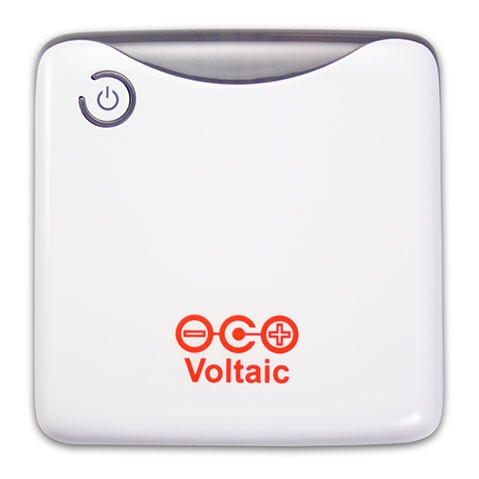

# mhip_tracker : Hardware

## Parts Used

- [Particle.io Boron](https://docs.particle.io/datasheets/cellular/boron-datasheet/)
  - An Arduino compatible controller with cellular connectivity.

    

- [Adafruit GPS FeatherWing](https://www.adafruit.com/product/3133)
  - -165 dBm sensitivity, 10 Hz updates, 66 channels with internal patch antenna

    

- [Adafruit Temperature/Humidity Sensor](https://www.adafruit.com/product/393)
  - wired DHT22 sensor in a plastic housing

    

- [Voltaic USB Battery Pack](https://www.voltaicsystems.com/v44)
  - Model V44, 12,000mAh / 44 Watt hour

    

- [Voltaic Solar Panel](https://www.voltaicsystems.com/9-watt-panel)
  - 9 watts, 6 volts, plugs directly into the V44 battery pack.

    

_todo: fritzing diagram, assembly_

**Copyright 2019, MagicHome Inc., All rights reserved.**
